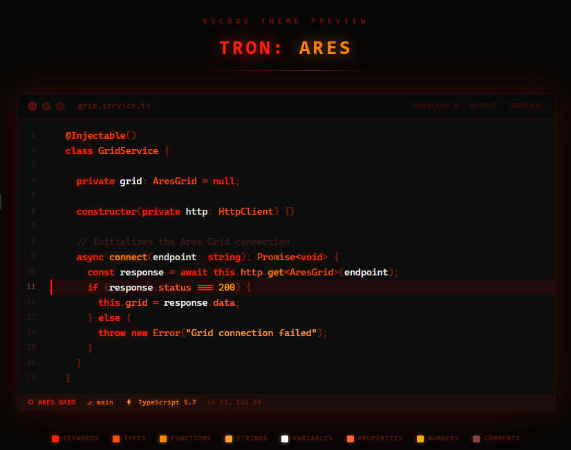

# Tron: Ares

A dark VS Code theme inspired by the visual aesthetic of **Tron: Ares** —
neon red circuits, amber glow and clean white on deep black.

## Color palette

| Token | Color |
|---|---|
| Keywords | Neon red `#FF2200` |
| Types | Orange-red `#FF5500` |
| Functions | Amber `#FF8800` |
| Strings | Light amber `#FFA040` |
| Variables | White `#FFFFFF` |
| Properties | Mid orange `#FF6633` |
| Numbers | Golden amber `#FFAA00` |
| Comments | Dark red `#4a1a1a` |

## Installation

Search for **Tron: Ares** in the VS Code Marketplace or install manually:

1. Download the `.vsix` file
2. Open VS Code → `Ctrl+Shift+P` → **Extensions: Install from VSIX...**
3. Activate via `Ctrl+K` → `Ctrl+T` → select **Tron: Ares**

## Optimized for

- TypeScript / JavaScript
- React / TSX
- JSON
- Markdown